# Database Schema and ERD (Milestone 6)

This document provides a detailed overview of the database design, tables, constraints, indices, and active entity relationships for the Vizorix backend application.

---

## Entity Relationship Diagram (ERD)

```mermaid
erDiagram
    users {
        UUID id PK
        VARCHAR email UK "NOT NULL"
        VARCHAR username UK "NOT NULL"
        VARCHAR password_hash "NOT NULL"
        BIGINT version "NOT NULL"
        TIMESTAMP created_at "NOT NULL"
        TIMESTAMP updated_at "NOT NULL"
    }

    projects {
        UUID id PK
        VARCHAR name "NOT NULL"
        TEXT description
        VARCHAR language "NOT NULL"
        TEXT source_code "NOT NULL"
        UUID user_id FK "NOT NULL"
        BIGINT version "NOT NULL"
        TIMESTAMP created_at "NOT NULL"
        TIMESTAMP updated_at "NOT NULL"
    }

    execution_sessions {
        UUID id PK
        UUID project_id FK "NOT NULL"
        VARCHAR status "NOT NULL"
        TEXT error_message
        BIGINT version "NOT NULL"
        TIMESTAMP created_at "NOT NULL"
        TIMESTAMP updated_at "NOT NULL"
    }

    execution_steps {
        UUID id PK
        UUID session_id FK "NOT NULL"
        INT step_number "NOT NULL"
        INT line_number "NOT NULL"
        VARCHAR method_name "NOT NULL"
        VARCHAR class_name "NOT NULL"
        TEXT stdout
        TEXT stderr
        BIGINT version "NOT NULL"
        TIMESTAMP created_at "NOT NULL"
        TIMESTAMP updated_at "NOT NULL"
    }

    variable_snapshots {
        UUID id PK
        UUID step_id FK "NOT NULL"
        VARCHAR name "NOT NULL"
        TEXT value "NOT NULL"
        VARCHAR type "NOT NULL"
        VARCHAR scope "NOT NULL"
        BIGINT version "NOT NULL"
        TIMESTAMP created_at "NOT NULL"
        TIMESTAMP updated_at "NOT NULL"
    }

    users ||--o{ projects : "manages (1:N, RESTRICT)"
    projects ||--o{ execution_sessions : "contains (1:N, CASCADE)"
    execution_sessions ||--o{ execution_steps : "records (1:N, CASCADE)"
    execution_steps ||--o{ variable_snapshots : "captures (1:N, CASCADE)"
```

---

## Tables Details and Constraints

### 1. `users`
*   Stores core user account credentials.
*   **Unique Constraints**: `email` and `username`.
*   **Indices**: Primary Key on `id` (native `UUID`).

### 2. `projects`
*   Stores workspace source code parameters.
*   **Foreign Key**: `user_id` referencing `users(id) ON DELETE RESTRICT` (prevents deleting user accounts if they contain active projects).
*   **Check Constraints**: Enforces `language` is `JAVA`.
*   **Indices**: Index `idx_projects_user_id` for optimization.

### 3. `execution_sessions`
*   Tracks execution sessions linked to code visualizer runs.
*   **Foreign Key**: `project_id` referencing `projects(id) ON DELETE CASCADE`.
*   **Check Constraints**: Enforces `status` in `('PENDING', 'RUNNING', 'SUCCESS', 'FAILED')`.
*   **Indices**: Index `idx_execution_sessions_project_id`.

### 4. `execution_steps`
*   Captures step snapshots in the visualizer timeline.
*   **Foreign Key**: `session_id` referencing `execution_sessions(id) ON DELETE CASCADE`.
*   **Indices**: Index `idx_execution_steps_session_id`.

### 5. `variable_snapshots`
*   Captures stack frame local and heap variables snapshots state mappings.
*   **Foreign Key**: `step_id` referencing `execution_steps(id) ON DELETE CASCADE`.
*   **Check Constraints**: Enforces `scope` in `('LOCAL', 'HEAP')`.
*   **Indices**: Index `idx_variable_snapshots_step_id`.
